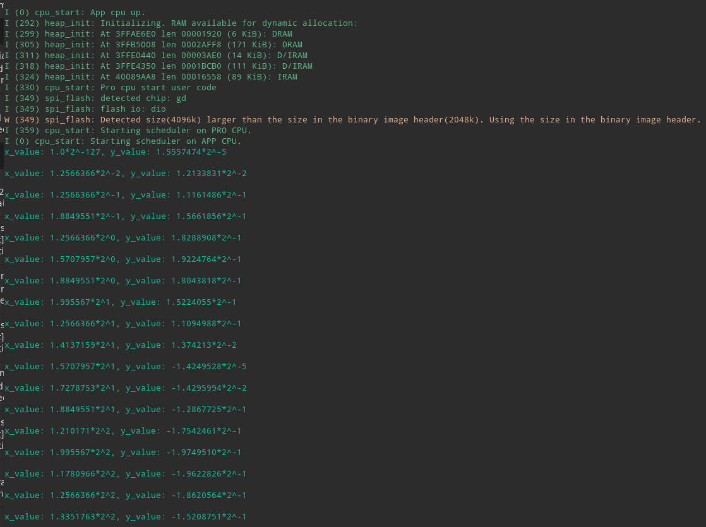

# ESP32 & Tensorflow

## ESP32 上的机器学习

人工智能之父，艾伦·图灵很早就曾预测“有一天，人们会带着电脑在公园散步，并告诉对方，今天早上我的计算机讲了个很有趣的事”。

人类一直试图让机器具有智能，也就是人工智能（Artificial Intelligence）。从上世纪50年代，人工智能的发展经历了“推理期”，通过赋予机器逻辑推理能力使机器获得智能，当时的AI程序能够证明一些著名的数学定理，但由于机器缺乏知识，远不能实现真正的智能。因此，70年代，人工智能的发展进入“知识期”，即将人类的知识总结出来教给机器，使机器获得智能。在这一时期，大量的专家系统问世，在很多领域取得大量成果，但由于人类知识量巨大，故出现“知识工程瓶颈”。

无论是“推理期”还是“知识期”，机器都是按照人类设定的规则和总结的知识运作，永远无法超越其创造者，其次人力成本太高。于是，一些学者就想到，如果机器能够自我学习问题不就迎刃而解了吗！机器学习（Machine Learning）方法应运而生，人工智能进入“机器学习时期”。

机器学习的核心是“使用算法解析数据，从中学习，然后对世界上的某件事情做出决定或预测”。这意味着，与其显式地编写程序来执行某些任务，不如教计算机如何开发一个算法来完成任务。

随着机器学习领域不断的发展，在移动、嵌入式和 IoT 设备上部署/运行机器学习模型也成为了可能。这篇文章仅介绍在 ESP32 上如何部署/运行 TensorFlow 模型。在[create\_sine\_model.ipynb](https://colab.research.google.com/github/tensorflow/tensorflow/blob/master/tensorflow/lite/micro/examples/hello_world/create_sine_model.ipynb#scrollTo=dh4AXGuHWeu1)文章中将介绍 “Hello World!” 正弦模型相关代码。

### TensorFlow Lite

TensorFlow 是一个端到端开源机器学习平台。它拥有一个包含各种工具、库和社区资源的全面灵活生态系统，可以让研究人员推动机器学习领域的先进技术的发展，并让开发者轻松地构建和部署由机器学习提供支持的应用。

TensorFlow Lite 是一组工具，可帮助开发人员在移动、嵌入式和 IoT 设备上部署/运行 TensorFlow 模型。 TensorFlow Lite 使设备上的机器学习推理具有低延迟的特性，并使可执行文件更小。

TensorFlow Lite 由两个主要组件组成： [TensorFlow Lite 解释器](https://www.tensorflow.org/lite/guide/inference?hl=zh_cn) 可在许多不同的硬件类型（包括手机，嵌入式 Linux 设备和微控制器）上运行经过优化的模型。 [TensorFlow Lite 转换器](https://www.tensorflow.org/lite/convert/index?hl=zh_cn) 将 TensorFlow 模型转换为供解释器使用的有效形式，并且可以优化模型以改善可执行文件大小和性能。

接下来，将介绍如何将 TensorFlow Lite 运行在 ESP32 上，有两种方式：

1. 使用 ESP-IDF
2. 使用 PlatformIO 平台

### 使用 ESP-IDF

#### 1. 搭建 ESP-IDF 开发环境

根据 [ESP-IDF Programming Guide](https://docs.espressif.com/projects/esp-idf/en/v4.0-beta2/get-started/index.html) 安装 工具链 和 ESP-IDF

检查 ESP-IDF 环境是否已经正确安装：

* 检查 `IDF_PATH` 环境变量是否已经设置
* 检查 `idf.py` 和 `xtensa-esp32-elf-*` 工具链是否在 PATH 环境变量中

#### 2. 克隆 TensorFlow

通过下面的命令，将 TensorFlow 克隆到本地：

```text
git clone https://github.com/tensorflow/tensorflow.git
```

#### 3. 生成 hello\_world 示例项目

在 tensorflow 目录下通过下面的命令，可以生成 hello\_world 示例项目：

```text
make -f tensorflow/lite/micro/tools/make/Makefile TARGET=esp generate_hello_world_esp_project
```

#### 4. 部署到 ESP32

在 hello\_world 项目目录下，编译、烧录可执行文件到 ESP32：

```text
cd tensorflow/lite/micro/tools/make/gen/esp_xtensa-esp32/prj/hello_world/esp-idf
idf.py --port /dev/ttyUSB0 flash monitor
```

运行结果： 



### 使用 PlatformIO 平台

#### 1. 安装 TensorFlow Lite 环境（PlatformIO）

首先，需要安装 PlatformIO ，打开终端输入：

```text
pip install -U platformio
```

#### 2. 新建 PlatformIO 项目

接下来可以开始搭建软件框架了，详细步骤：

1. 创建项目目录，包含 src，lib，include 文件夹
2. 新建 `platformio.ini` 文件，文件内容：

```text
[env:esp32doit-devkit-v1]
platform = espressif32
board = esp32doit-devkit-v1
framework = arduino
board_build.partitions = custom.csv
lib_deps=tfmicro
```

1. 新建 `custom.csv` 文件，文件内容：

```text
# Name,   Type, SubType, Offset,   Size, Flags
nvs,      data, nvs,     0x9000,   20K,
otadata,  data, ota,     0xe000,   8K,
firm,     app,  ota_0,   , 3400K,
eeprom,   data, 0x99,    , 4K,
spiffs,   data, spiffs,  , 444K,
```

#### 3. 生成 hello\_world 示例项目

1. 在项目目录所在目录下，克隆 TensorFlow 仓库

   `git clone https://github.com/tensorflow/tensorflow.git`

2. 生成 ESP32 示例项目，获取生成的 tfmicro 库和示例模型，在 Tensorflow 目录下，运行： `make -f tensorflow/lite/micro/tools/make/Makefile TARGET=esp generate_hello_world_esp_project` 生成的示例项目位于： `tensorflow/tensorflow/lite/micro/tools/make/gen/esp_xtensa-esp32/prj/hello_world/`

#### 4. 修改 PlatformIO 项目

1. 在 hello\_world/esp-idf 目录中拷贝 tfmicro 文件夹到 项目目录下的 lib 文件夹
2. 在 main 目录中拷贝 sin\_model\_data.cc 到 项目目录下的 src 文件夹，拷贝 sine\_model\_data.h 到 项目目录下的 include 文件夹
3. 在 third\_party/flatbuffers/include 目录中拷贝 flatbuffers 目录到 tfmicro 文件夹.
4. 在 third\_party/gemmlowp 目录中拷贝 fixedpoint 和 internal 目录到 tfmicro 文件夹.
5. 在 third\_party 目录中拷贝 kissfft 目录到 tfmicro 文件夹.
6. 在 third\_party/flatbuffers/include 目录中拷贝 flatbuffers 到 tfmicro 文件夹
7. 在 lib/tfmicro/flatbuffers 目录下打开 base.h, 将以下代码段

```text
#if defined(ARDUINO) && !defined(ARDUINOSTL_M_H)
  #include <utility.h>
#else
  #include <utility>
#endif
```

修改为:

```text
#include <utility>
```

1. 接下来修改 “Hello World!” sin 模型来测试 TensorFlow Lite 是否正常工作，完整的源代码请在 GitHub 仓库中查看

代码仓库链接：[ESP32-TensorFlow-Lite-Sample](https://github.com/wezleysherman/ESP32-TensorFlow-Lite-Sample)

代码结构：


#### 5. 部署到 ESP32

在终端中输入以下命令将可执行文件烧录到 ESP32：

```text
platformio run -t upload --upload-port /dev/ttyUSB0
```

在终端中输入以下命令将打开串口交互终端，输入一个浮点数，程序将给出 sin 模型预测的值：

```text
screen /dev/ttyUSB0 115200
```

运行结果： 


### 开发工作流程

这是将 TensorFlow 模型部署到微控制器的过程：

1. 创建或获取 TensorFlow 模型 该模型必须非常小，以便在转换后适合您的目标设备。它只能使用支持的操作。如果要使用当前不被支持的操作，可以提供自己的实现。
2. 将模型转换为 TensorFlow Lite FlatBuffer 您将使用 TensorFlow Lite 转换器来将模型转换为标准 TensorFlow Lite 格式。您可能希望输出量化模型，因为它们的尺寸更小、执行效率更高。
3. 将 FlatBuffer 转换为 C byte 数组 模型保存在只读程序存储器中，并以简单的 C 文件的形式提供。标准工具可用于将 FlatBuffer 转换为 C 数组。
4. 集成 TensorFlow Lite for Microcontrollers 的 C++ 库 编写微控制器代码以使用 C++ 库执行推断。
5. 部署到您的设备 构建程序并将其部署到您的设备。

## 参考链接

* [esp-idf](https://github.com/espressif/esp-idf)
* [Tensorflow](https://github.com/tensorflow/tensorflow)
* [create\_sine\_model.ipynb](https://colab.research.google.com/github/tensorflow/tensorflow/blob/master/tensorflow/lite/micro/examples/hello_world/create_sine_model.ipynb#scrollTo=dh4AXGuHWeu1)
* [TensorFlow, Meet The ESP32](https://towardsdatascience.com/tensorflow-meet-the-esp32-3ac36d7f32c7)

