# TensorFlow Lite - Hello World

这篇文章将介绍使用 TensorFlow Lite for Microcontrollers 的基础知识。它包括训练模型，将其转换为 TensorFlow Lite 版本使用以及在微控制器上运行的完整的端到端工作流程。

该示例由训练过的模型构建，该模型可提供 sin 函数的功能。它包含几个平台的实现，在每种实现中，该模型都用于生成数据，该数据用于使 LED 闪烁或控制动画。

## 1. 导入依赖

```text
## TensorFlow is an open source machine learning library
## Note: The following line is temporary to use v2
!pip install tensorflow==2.0.0-beta0
import tensorflow as tf
## Numpy is a math library
import numpy as np
## Matplotlib is a graphing library
import matplotlib.pyplot as plt
## math is Python's math library
import math
```

## 2. 生成数据

深度学习网络是对基础数据中的模型进行建模。我们将训练神经网络以对 sin 函数生成的数据建模。这将产生一个可以取值 x 并预测其正弦值 y 的模型。

在实际应用中，如果需要 x 的正弦值，则可以直接计算它。但是，通过训练一个模型来做到这一点，我们可以证明机器学习的基本原理。

在 TensorFlow Lite for Microcontrollers 的 hello\_world 示例中，我们将使用此模型来控制按顺序点亮的 LED。

以下的代码将生成一组随机 x 值，计算其正弦值，并将其显示在图形上：

```text
## We'll generate this many sample datapoints
SAMPLES = 1000
​
## Set a "seed" value, so we get the same random numbers each time we run this
## notebook
np.random.seed(1337)
​
## Generate a uniformly distributed set of random numbers in the range from
## 0 to 2π, which covers a complete sine wave oscillation
x_values = np.random.uniform(low=0, high=2*math.pi, size=SAMPLES)
​
## Shuffle the values to guarantee they're not in order
np.random.shuffle(x_values)
​
## Calculate the corresponding sine values
y_values = np.sin(x_values)
​
## Plot our data. The 'b.' argument tells the library to print blue dots.
plt.plot(x_values, y_values, 'b.')
plt.show()
```

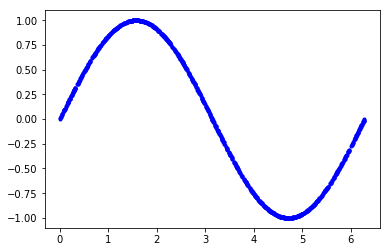

## 3. 添加噪声

由于上面的数据是直接由 sin 函数生成的，因此我们的数据拟合出一条平滑的曲线。

但是，机器学习模型应该是从现实世界数据中提取潜在含义。为了证明这一点，我们可以在数据中添加一些噪声以逼近现实世界的数据。

在下面的代码中，我们将为每个值添加一些随机噪声，然后绘制一个新图形：

```text
## Add a small random number to each y value
y_values += 0.1 * np.random.randn(*y_values.shape)
​
## Plot our data
plt.plot(x_values, y_values, 'b.')
plt.show()
```

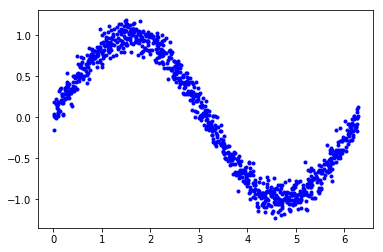

## 4. 数据分割

现在，我们有一个数据集，可以近似现实世界的数据。我们将使用它来训练我们的模型。

为了评估我们训练的模型的准确性，我们需要将其预测值与真实数据进行比较，并检查它们的匹配程度。这种评估在训练期间（称为验证）和训练之后（称为测试）进行。在两种情况下，我们都使用尚未用于训练模型的新数据。

为了确保我们有可用于评估的数据，在开始训练之前，我们会预留一些空间。我们将保留 20％ 的数据用于验证，另外 20％ 的数据用于测试。剩余的 60％ 将用于训练模型。这是训练模型时经常使用的拆分方式。

以下代码将拆分我们的数据，然后将每个数据集绘制为不同的颜色：

```text
## We'll use 60% of our data for training and 20% for testing. The remaining 20%
## will be used for validation. Calculate the indices of each section.
TRAIN_SPLIT =  int(0.6 * SAMPLES)
TEST_SPLIT = int(0.2 * SAMPLES + TRAIN_SPLIT)
​
## Use np.split to chop our data into three parts.
## The second argument to np.split is an array of indices where the data will be
## split. We provide two indices, so the data will be divided into three chunks.
x_train, x_test, x_validate = np.split(x_values, [TRAIN_SPLIT, TEST_SPLIT])
y_train, y_test, y_validate = np.split(y_values, [TRAIN_SPLIT, TEST_SPLIT])
​
## Double check that our splits add up correctly
assert (x_train.size + x_validate.size + x_test.size) ==  SAMPLES
​
## Plot the data in each partition in different colors:
plt.plot(x_train, y_train, 'b.', label="Train")
plt.plot(x_test, y_test, 'r.', label="Test")
plt.plot(x_validate, y_validate, 'y.', label="Validate")
plt.legend()
plt.show()
```

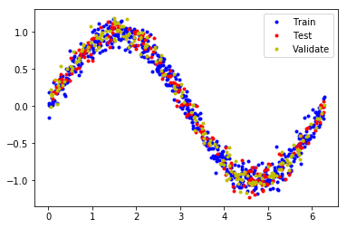

## 5. 设计模型

我们将构建一个模型，该模型将采用一个输入值（在本例中为 x），并使用它来预测一个数字输出值（x 的正弦）。这种类型的问题称为回归。

为了实现这一点，我们将创建一个简单的神经网络。它将使用神经元层来尝试学习训练数据背后的任何模式，因此可以做出预测。

首先，我们将定义两层。第一层接受一个输入（我们的 x 值），并通过 16 个神经元运行它。基于此输入，每个神经元将根据其内部状态（其权重和偏差值）计算一个中间结果。

来自第一层的输出值将作为输入馈送到第二层，即第二层神经元。它将对这些输入施加自己的权重和偏差，并计算其自身的结果，将其作为我们的 y 值输出。

以下代码中使用 TensorFlow 中用于创建深度学习网络的高级 API -- Keras 定义我们的模型。定义神经网络后，我们将对其进行编译，并指定确定如何训练神经网络的参数：

```text
## We'll use Keras to create a simple model architecture from tensorflow.keras import layers
model_1 = tf.keras.Sequential()
​
## First layer takes a scalar input and feeds it through 16 "neurons". The
## neurons decide whether to activate based on the 'relu' activation function.
model_1.add(layers.Dense(16, activation='relu', input_shape=(1,)))
​
## Final layer is a single neuron, since we want to output a single value
model_1.add(layers.Dense(1))
​
## Compile the model using a standard optimizer and loss function for regression
model_1.compile(optimizer='rmsprop', loss='mse', metrics=['mae'])
```

## 6. 训练模型

定义模型后，就可以使用我们的数据进行训练了。训练包括将 x 值传递到神经网络，检查神经的输出与预期y值的偏离程度，并调整神经元的权重和偏差，以使下次使用。

以下的代码中使用训练数据中的 x 和 y 值训练模型。我们还传递了一些数据用于验证。训练可能需要一段时间才能完成：

```text
## Train the model on our training data while validating on our validation set
history_1 = model_1.fit(x_train, y_train, epochs=1000, batch_size=16, validation_data=(x_validate, y_validate))
```

## 7. 检查训练指标

在训练期间，将不断根据我们的训练数据和我们先前保留的验证数据来评估模型的性能。 训练会产生数据日志，告诉我们模型的性能在训练过程中是如何变化的。

以下代码将以图形形式显示某些数据：

```text
## Draw a graph of the loss, which is the distance between
## the predicted and actual values during training and validation.
loss = history_1.history['loss']
val_loss = history_1.history['val_loss']
​
epochs = range(1, len(loss) + 1)
​
plt.plot(epochs, loss, 'g.', label='Training loss')
plt.plot(epochs, val_loss, 'b', label='Validation loss')
plt.title('Training and validation loss')
plt.xlabel('Epochs')
plt.ylabel('Loss')
plt.legend()
plt.show()
```

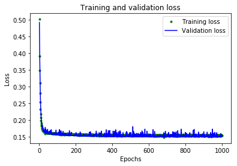

## 8. 查看数据

该图显示了每个周期的损失（或模型的预测与实际数据之间的差异）。 有几种计算损失的方法，我们使用的方法是均方误差。 对于训练和验证数据有明显的损失值。

我们可以看到，损失的数量在前 25 个周期迅速减少，然后趋于平稳。 这意味着该模型正在改进并产生更准确的预测！

我们的目标是在模型不再改进或训练损失小于验证损失时停止训练，这意味着该模型已学会很好地预测训练数据，以致无法再推广到新的训练数据。

为了使图表的平坦部分更具可读性，让我们跳过前 50 个周期：

```text
## Exclude the first few epochs so the graph is easier to read
SKIP = 50
​
plt.plot(epochs[SKIP:], loss[SKIP:], 'g.', label='Training loss')
plt.plot(epochs[SKIP:], val_loss[SKIP:], 'b.', label='Validation loss')
plt.title('Training and validation loss')
plt.xlabel('Epochs')
plt.ylabel('Loss')
plt.legend()
plt.show()
```

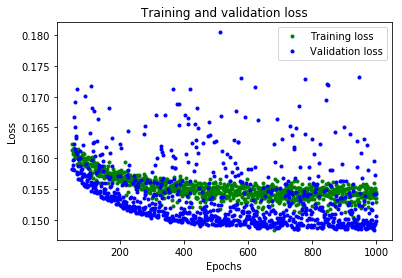

## 9. 进一步指标

从图中可以看出，损失持续减少，直到大约 600 个周期为止，此时该损失基本稳定。 这意味着无需训练我们的神经网络超过 600 个周期。

但是，我们还可以看到最低的损耗值仍在 0.155 左右。这意味着我们的神经网络的预测平均降低了约 15％。另外，验证损失值跳跃很多，有时甚至更高。

为了更深入地了解我们模型的性能，我们可以绘制更多数据。 这次，我们将绘制平均绝对误差图，这是另一种衡量神经网络预测与实际数字的距离的方法：

```text
plt.clf()
​
## Draw a graph of mean absolute error, which is another way of
## measuring the amount of error in the prediction.
mae = history_1.history['mae']
val_mae = history_1.history['val_mae']
​
plt.plot(epochs[SKIP:], mae[SKIP:], 'g.', label='Training MAE')
plt.plot(epochs[SKIP:], val_mae[SKIP:], 'b.', label='Validation MAE')
plt.title('Training and validation mean absolute error')
plt.xlabel('Epochs')
plt.ylabel('MAE')
plt.legend()
plt.show()
```

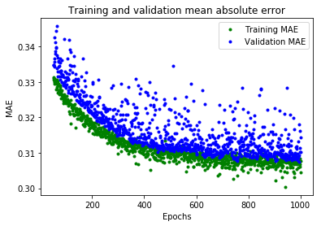

这个平均绝对误差图可以看到另外的情况。 我们可以看到训练数据显示出的错误始终比验证数据低，这意味着神经网络可能过拟合，或者过于刻板地学习了训练数据，因此无法对新数据做出有效的预测。

此外，平均绝对误差值非常高，最多约为 0.305，这意味着该模型的某些预测至少可降低 30％。30％ 的误差意味着我们离精确建模 sin 函数还很远。

为了更深入地了解正在发生的事情，我们可以针对期望值绘制神经网络对训练数据的预测：

```text
## Use the model to make predictions from our validation data
predictions = model_1.predict(x_train)
​
## Plot the predictions along with to the test data
plt.clf()
plt.title('Training data predicted vs actual values')
plt.plot(x_test, y_test, 'b.', label='Actual')
plt.plot(x_train, predictions, 'r.', label='Predicted')
plt.legend()
plt.show()
```

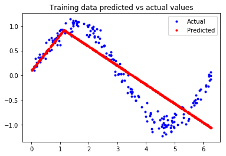

该图清楚地表明，我们的神经网络已经学会了以非常有限的方式近似 sin 函数。 在 `0 <= x <= 1.1` 区间内，效果最好，但对于我们其他的 x 值，充其量只是一个大概的近似值。

这种拟合的表明，该模型没有足够的能力来学习 sin 函数的全部复杂度，因此只能以过于简单的方式对其进行近似。 通过扩大模型，我们应该能够改善其性能。

## 10. 修改模型

为了使我们的模型更强大，让我们添加额外的神经元层。 以下代码用之前相同的方式重新定义了我们的模型，但中间增加了 16 个神经元层：

```text
model_2 = tf.keras.Sequential()
​
## First layer takes a scalar input and feeds it through 16 "neurons". The
## neurons decide whether to activate based on the 'relu' activation function.
model_2.add(layers.Dense(16, activation='relu', input_shape=(1,)))
​
## The new second layer may help the network learn more complex representations
model_2.add(layers.Dense(16, activation='relu'))
​
## Final layer is a single neuron, since we want to output a single value
model_2.add(layers.Dense(1))
​
## Compile the model using a standard optimizer and loss function for regression
model_2.compile(optimizer='rmsprop', loss='mse', metrics=['mae'])
```

现在，我们将训练新模型。 为了节省时间，我们只训练 600 个周期：

```text
history_2 = model_2.fit(x_train, y_train, epochs=600, batch_size=16, validation_data=(x_validate, y_validate))
```

## 11. 评估新模型

在每个训练周期，模型都会打印出其损失和平均绝对误差，以进行训练和验证。

以下代码将打印与我们用于评估原始模型的图表相同的图表，但显示了新的训练历史数据：

```text
## Draw a graph of the loss, which is the distance between
## the predicted and actual values during training and validation.
loss = history_2.history['loss']
val_loss = history_2.history['val_loss']
​
epochs = range(1, len(loss) + 1)
​
plt.plot(epochs, loss, 'g.', label='Training loss')
plt.plot(epochs, val_loss, 'b', label='Validation loss')
plt.title('Training and validation loss')
plt.xlabel('Epochs')
plt.ylabel('Loss')
plt.legend()
plt.show()
​
## Exclude the first few epochs so the graph is easier to read
SKIP = 100
​
plt.clf()
​
plt.plot(epochs[SKIP:], loss[SKIP:], 'g.', label='Training loss')
plt.plot(epochs[SKIP:], val_loss[SKIP:], 'b.', label='Validation loss')
plt.title('Training and validation loss')
plt.xlabel('Epochs')
plt.ylabel('Loss')
plt.legend()
plt.show()
​
plt.clf()
​
## Draw a graph of mean absolute error, which is another way of
## measuring the amount of error in the prediction.
mae = history_2.history['mae']
val_mae = history_2.history['val_mae']
​
plt.plot(epochs[SKIP:], mae[SKIP:], 'g.', label='Training MAE')
plt.plot(epochs[SKIP:], val_mae[SKIP:], 'b.', label='Validation MAE')
plt.title('Training and validation mean absolute error')
plt.xlabel('Epochs')
plt.ylabel('MAE')
plt.legend()
plt.show()
```

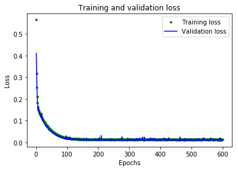

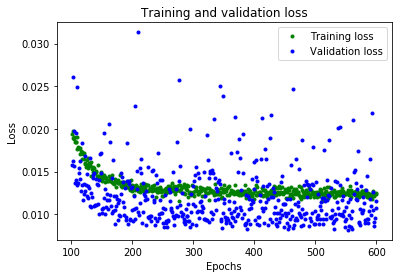

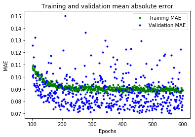

从这些图中，我们可以看到一些：

* 我们的神经网络达到了峰值精度的速度要快得多（在 200 个周期内，而不是 600 个周期内）
* 总损失和 MAE 比我们以前的神经网络要好得多
* 指标比训练更适合进行验证，这意味着神经网络不会过度拟合

验证指标优于训练指标的原因是，验证指标是在每个周期结束时计算的，而训练指标是在整个训练过程结束后计算的，因此验证发生在训练时间稍长的模型上。

这一切都意味着我们的神经网络似乎运行良好。为了确认这一点，让我们对照我们先前预留的测试数据集检查其预测：

```text
## Calculate and print the loss on our test dataset
loss = model_2.evaluate(x_test, y_test)
​
## Make predictions based on our test dataset
predictions = model_2.predict(x_test)
​
## Graph the predictions against the actual values
plt.clf()
plt.title('Comparison of predictions and actual values')
plt.plot(x_test, y_test, 'b.', label='Actual')
plt.plot(x_test, predictions, 'r.', label='Predicted')
plt.legend()
plt.show()
```

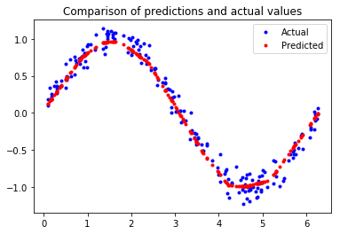

打印的评估指标表明，该模型在测试数据上具有较低的损失和 MAE，并且预测在视觉上与我们的数据相当吻合。

该模型并不完美； 它的预测不会形成平滑的正弦曲线。 例如，当 x 在 4.2 和 5.2 之间时，曲线几乎是直线。 如果我们想让模型更加请打，我们可以尝试进一步增加模型的容量，也许使用一些技术来防止过度拟合。

但是，机器学习的重要部分是知道何时退出，该模型对于我们的用例来说已经足够好，可以使一些 LED 以令人愉悦的模式闪烁。

## 12. 转换为 TensorFlow Lite

现在，我们有了一个可以接受的准确的模型。 但是，要将其与 TensorFlow Lite for Microcontrollers 一起使用，我们需要将其转换为正确的格式，然后将其下载为文件。 为此，我们将使用 TensorFlow Lite 转换器。转换器以特殊的，节省空间的格式输出文件，以供受内存限制的设备使用。

由于此模型将部署在微控制器上，因此我们希望它尽可能小！减小模型大小的一种技术称为量化。 它降低了模型权重的精度，从而节省了内存，通常对精度没有太大影响。量化模型的运行速度也更快，因为所需的计算更加简单。

TensorFlow Lite 转换器可以在转换模型时应用量化。在以下代码中，我们将模型转换两次：一次使用量化，一次不使用：

```text
## Convert the model to the TensorFlow Lite format without quantization
converter = tf.lite.TFLiteConverter.from_keras_model(model_2)
tflite_model = converter.convert()
​
## Save the model to disk
open("sine_model.tflite", "wb").write(tflite_model)
​
## Convert the model to the TensorFlow Lite format with quantization
converter = tf.lite.TFLiteConverter.from_keras_model(model_2)
converter.optimizations = [tf.lite.Optimize.OPTIMIZE_FOR_SIZE]
tflite_model = converter.convert()
​
## Save the model to disk
open("sine_model_quantized.tflite", "wb").write(tflite_model)
```

## 13. 测试转换后的模型

为了证明这些模型在转换和量化后仍然是准确的，我们将使用它们两者进行预测并将其与我们的测试结果进行比较：

```text
## Instantiate an interpreter for each model
sine_model = tf.lite.Interpreter('sine_model.tflite')
sine_model_quantized = tf.lite.Interpreter('sine_model_quantized.tflite')
​
## Allocate memory for each model
sine_model.allocate_tensors()
sine_model_quantized.allocate_tensors()
​
## Get the input and output tensors so we can feed in values and get the results
sine_model_input = sine_model.tensor(sine_model.get_input_details()[0]["index"])
sine_model_output = sine_model.tensor(sine_model.get_output_details()[0]["index"])
sine_model_quantized_input = sine_model_quantized.tensor(sine_model_quantized.get_input_details()[0]["index"])
sine_model_quantized_output = sine_model_quantized.tensor(sine_model_quantized.get_output_details()[0]["index"])
​
## Create arrays to store the results
sine_model_predictions = np.empty(x_test.size)
sine_model_quantized_predictions = np.empty(x_test.size)
​
## Run each model's interpreter for each value and store the results in arrays
for i in range(x_test.size):
  sine_model_input().fill(x_test[i])
  sine_model.invoke()
  sine_model_predictions[i] = sine_model_output()[0]
​
  sine_model_quantized_input().fill(x_test[i])
  sine_model_quantized.invoke()
  sine_model_quantized_predictions[i] = sine_model_quantized_output()[0]
​
## See how they line up with the data
plt.clf()
plt.title('Comparison of various models against actual values')
plt.plot(x_test, y_test, 'bo', label='Actual')
plt.plot(x_test, predictions, 'ro', label='Original predictions')
plt.plot(x_test, sine_model_predictions, 'bx', label='Lite predictions')
plt.plot(x_test, sine_model_quantized_predictions, 'gx', label='Lite quantized predictions')
plt.legend()
plt.show()
```

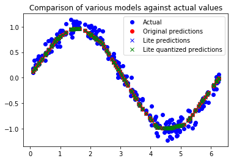

从图中可以看出，原始模型，转换后的模型和量化模型的预测都足够接近，无法区分。 这意味着我们的量化模型已经可以使用。

我们可以打印出文件大小的差异：

```text
import os
basic_model_size = os.path.getsize("sine_model.tflite")
print("Basic model is %d bytes" % basic_model_size)
quantized_model_size = os.path.getsize("sine_model_quantized.tflite")
print("Quantized model is %d bytes" % quantized_model_size)
difference = basic_model_size - quantized_model_size
print("Difference is %d bytes" % difference)
```

结果：

```text
Basic model is 2656 bytes
Quantized model is 2640 bytes
Difference is 16 bytes
```

我们的量化模型仅比原始版本小 16 个字节，大小仅小幅减少。因为该模型的大小约为 2.6 KB，已经很小了，权重仅占整体大小的一小部分，这意味着量化的影响很小。

但是，对于较复杂的模型具有更多的权重，这意味着量化模型可以节省的空间将更多。

无论如何，我们的量化模型执行所需的时间将少于原始版本，这对于微型微控制器而言非常重要！

## 13. 转换为 C 源文件

准备用于 TensorFlow Lite for Microcontrollers 的模型的最后一步是将其转换为 C 源文件。 您可以在 `hello_world/sine_model_data.cc` 中查看此格式的示例。

为此，我们可以使用名为 `xxd` 的命令行应用程序。 以下单元格在我们的量化模型上运行 `xxd` 并打印输出：

```text
## Install xxd if it is not available
!apt-get -qq install xxd
## Save the file as a C source file
!xxd -i sine_model_quantized.tflite > sine_model_quantized.cc
## Print the source file
!cat sine_model_quantized.cc
```

